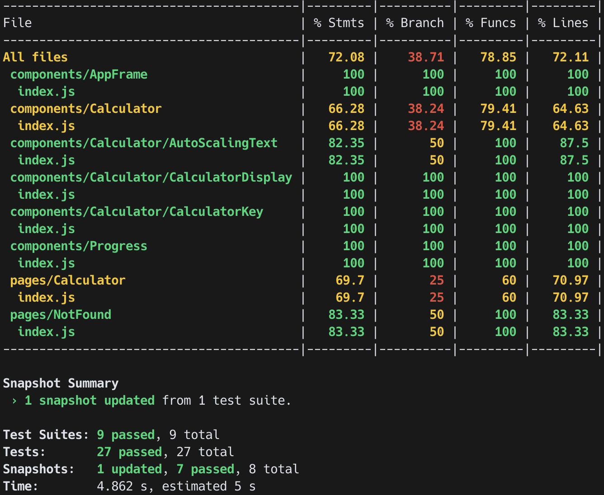

# React Calculator


[](https://codecov.io/gh/tpps88206/calculator)


## Demo

https://tpps88206.github.io/calculator/

## Setup

```
$ git clone https://github.com/tpps88206/calculator.git
$ cd calculator/
$ yarn install
$ yarn start
```

## Technologies

* Use **React Hook**
* Develop state management with [Redux](https://redux.js.org/) and [Redux Toolkit](https://redux-toolkit.js.org/).
* Develop CSS style with [@material-ui/styles](https://material-ui.com/styles/basics/)
* Develop router management with [React Router](https://github.com/ReactTraining/react-router).
* Write unit test with **testing-library**.
* Use [Github Actions](https://github.com/features/actions) to implement CI/CD and deploy on **Github Page**.
* Use [Material UI](https://material-ui.com/zh/) to generate the beautiful components with Material Design.
* Use **OOCSS** to manage the general CSS style, it is following [Bootstrap](https://getbootstrap.com/).
* Use [react-point](https://github.com/ReactTraining/react-point) to handle touch events.
* Use [react-draggable](https://github.com/STRML/react-draggable) to handle Drag and Drop.
* Use [Lodash](https://lodash.com/) to control logic methods.
* Use [Classnames](https://github.com/JedWatson/classnames) to manage CSS class name.
* Use [Husky](https://typicode.github.io/husky/#/) to handle pre-commit event.
* All icons are using [Material Icon](https://material-ui.com/components/material-icons/) or **SVG**.
* Define coding style with [Prettier](https://prettier.io/) and **Eslint**.

## Features

* Implement the general functions of calculator.
* In the desktop
    * The width of calculator will fix in `480px`. 
    * But when the browser width is smaller than 768px, the width of calculator will fix in `360px`.
    * We can drag and drop the calculator to everywhere.
* In the mobile    
    * Calculator will fix below, and the height is `50%` of the browser.
    * We can not drag and drop but we can scroll it.
* We can open calculator with clicking button and close it with clicking outside.


## Unit test report


